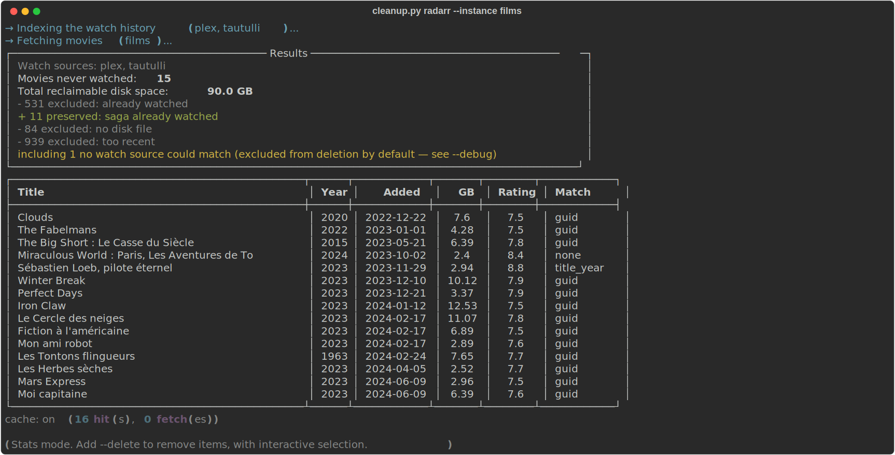
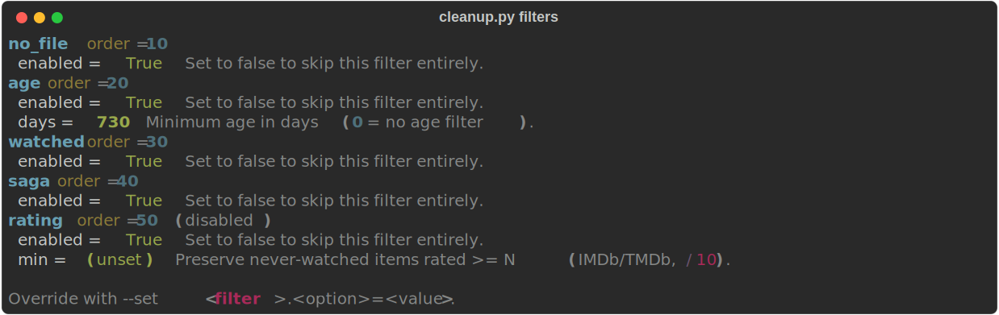
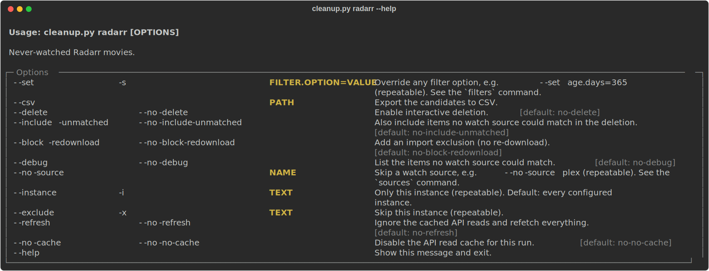

# arr-cleanup

Finds movies (Radarr) and series (Sonarr) that nobody ever watched, by
cross-referencing them with Plex and Tautulli. Reports by default, deletes only
when asked.

```bash
python cleanup.py radarr                 # stats only, never deletes
python cleanup.py sonarr --delete        # interactive deletion
```



The summary accounts for every item: what was excluded, what a filter preserved,
and what no watch source could match. The table is only the leftovers.

Connection settings live in `config.toml` (see `config.example.toml`).
Filter criteria do not, they are passed on the command line.

Every filter is active by default except `rating`, which stays off until you
give it a threshold. `python cleanup.py filters` shows the current state !
Change any of it for a run with `--set`:

```bash
python cleanup.py radarr --set age.days=365 --set rating.min=7.5
```

## Filters

`--set <filter>.<option>=<value>`, repeatable.

| Filter    | Active | Option | Default | Effect                                                  |
|-----------|--------|--------|---------|---------------------------------------------------------|
| `no_file` | yes    | —      |         | drops items with no file on disk                        |
| `age`     | yes    | `days` | `730`   | minimum age before an item is considered (`0` disables) |
| `watched` | yes    | —      |         | drops items already played at least once                |
| `saga`    | yes    | —      |         | protects an unseen movie whose collection was watched   |
| `rating`  | no     | `min`  | unset   | protects unseen items rated >= N (/10)                  |

Every filter also takes `enabled`, so `--set saga.enabled=false` skips it entirely for that run.

This table can drift; `python cleanup.py filters` cannot, since it reads the
filters themselves. Trust it over this page.



## Watch sources

`python cleanup.py sources` lists them and says which are configured. Plex is
strongly recommended. Skip one for a run with `--no-source plex` or `--no-source tautulli`.


## Other commands

| Command       | What it does                        |
|---------------|-------------------------------------|
| `instances`   | lists the configured *arr instances |
| `filters`     | lists the filters and their options |
| `sources`     | lists the watch sources             |
| `cache-clear` | empties the API read cache          |

Each *arr can be configured several times (films, 4k, anime...), every one of them is processed unless `--instance` or `--exclude` says otherwise.


## Run options

`radarr` and `sonarr` take the same ones:



## Deleting

`--delete` opens an interactive selection. It always refetches from the *arr
first: deleting against a stale listing is not acceptable.

Items that no watch source could match are excluded from deletion by default,
since "never watched" cannot be distinguished from "never seen by any source".
`--debug` lists them, `--include-unmatched` deletes them anyway.

`--block-redownload` also adds an import exclusion, so the *arr will not grab
the item again.

## Captures

The terminal captures above are generated, not screenshotted, so they can be
rebuilt when the output changes:

```bash
python docs/capture.py            # all of them
python docs/capture.py filters    # only the matching ones
```

They run against whatever `config.toml` points at, read-only. Hostnames are
rewritten on the way out.
